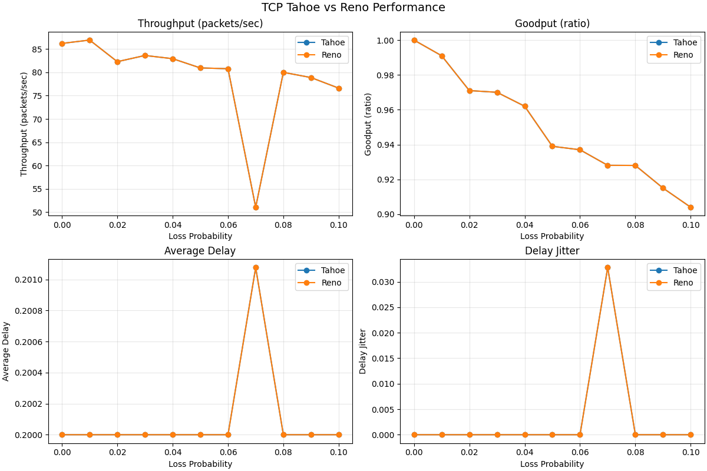
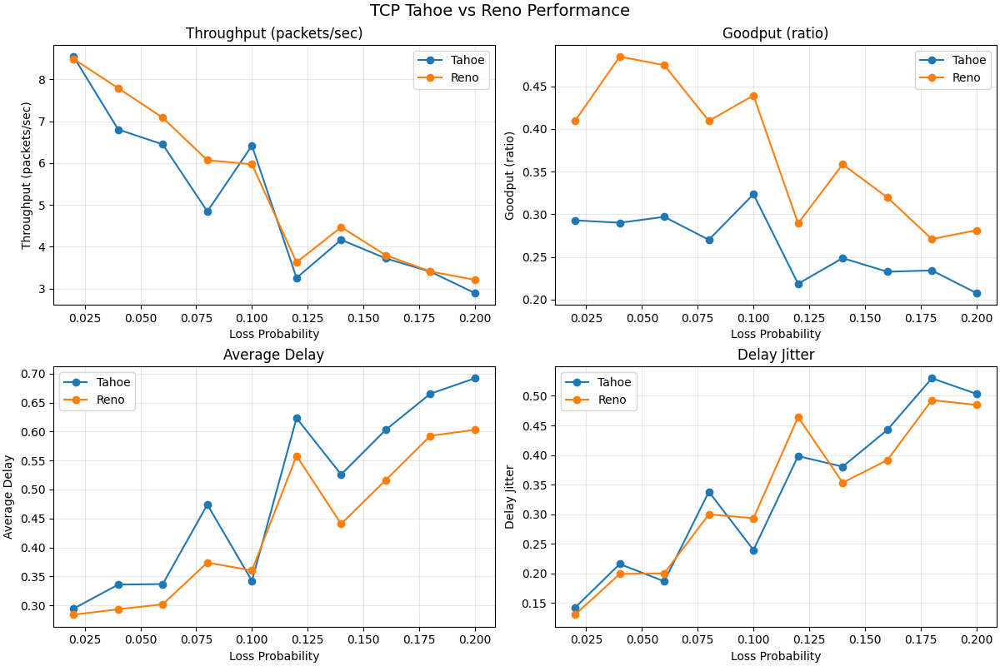

# PA-2 Report: TCP Tahoe vs TCP Reno in a Discrete Event Simulator

## 1. Objective

This project evaluates TCP Tahoe and TCP Reno using a discrete event simulator (DES).  
The goal is to compare performance under packet loss using multiple metrics and explain observed behavior.

## 2. Simulation Setup

### 2.1 Core Simulator (Theo)

The simulator provides:

- Simulated clock
- Event queue and event dispatch (`SEND`, `RECEIVE`, `ACK`, `TIMEOUT`, `DROP`)
- Network model with fixed one-way propagation delay and configurable packet loss probability
- Metrics collection for throughput, goodput, average delay, and jitter

### 2.2 TCP Implementations (Leo)

- TCP Tahoe
- TCP Reno
- Loss sweep runner and graph generation

### 2.3 Shared assumptions

- Loss is applied to data packets only
- ACK path is reliable in the selected model
- Timeouts are per-packet
- Jitter is population standard deviation

## 3. Performance Metrics

The following metrics are used:

- **Throughput**: `unique_packets_received / total_simulated_time`
- **Goodput**: `unique_packets_delivered / total_packets_sent`
- **Average Delay**: `mean(time_ACKed - time_first_sent)`
- **Delay Jitter**: `std_dev(individual_delays)`

At least two metrics were required; this report uses all four.

## 4. Attempt 1 (Baseline Environment)

### 4.1 Why this attempt showed similar Tahoe/Reno behavior

In the baseline environment:

- Receiver behavior was simple and often did not create strong duplicate-ACK patterns
- Loss sweep was mild (`0.00` to `0.10`)
- Under these conditions, both algorithms tended to follow similar effective recovery behavior

### 4.2 Baseline summary metrics (averaged over loss sweep)

| Metric | Tahoe | Reno | Better |
|---|---:|---:|---|
| Throughput | 79.1122 | 79.1122 | Tie |
| Goodput | 0.9496 | 0.9496 | Tie |
| Avg Delay | 0.2001 | 0.2001 | Tie |
| Jitter | 0.0030 | 0.0030 | Tie |

### 4.3 Baseline graph



## 5. Attempt 2 (Adjusted Environment to Expose Differences)

To better highlight algorithm differences, a second environment was added.

### 5.1 Changes made

- Receiver mode changed to **gap-aware cumulative ACK** (allows duplicate ACK behavior on out-of-order/loss events)
- Loss sweep changed to `0.02` to `0.20` (step `0.02`)
- `total_packets` set to `400`
- `timeout_interval` set to `0.9`
- `initial_cwnd` set to `6.0`
- `initial_ssthresh` set to `24.0`

### 5.2 Adjusted scenario summary metrics (averaged over loss sweep)

| Metric | Tahoe | Reno | Better |
|---|---:|---:|---|
| Throughput | 5.0490 | 5.3912 | Reno |
| Goodput | 0.2615 | 0.3737 | Reno |
| Avg Delay | 0.4892 | 0.4324 | Reno |
| Jitter | 0.3376 | 0.3309 | Reno |

### 5.3 Adjusted scenario graph



## 6. Observations

1. In the baseline setup, Tahoe and Reno produced nearly identical results because the environment did not strongly trigger Reno's fast recovery advantage.
2. After introducing a gap-aware ACK environment and harsher loss conditions, Reno outperformed Tahoe on all reported metrics.
3. The adjusted scenario better reflects the expected protocol-level difference: Reno generally recovers more efficiently under repeated loss events due to fast retransmit/fast recovery behavior.

## 7. Conclusion

The project successfully implemented and compared TCP Tahoe and TCP Reno using a DES.  
Two scenarios were evaluated:

- A baseline environment where results were similar
- An adjusted environment where Reno's improvement became clear

This two-attempt comparison is useful for analysis and reporting because it explains both:

- why initial results can look similar,
- and how simulation conditions affect visibility of algorithm differences.

## 8. Reproducibility

From the project root:

```bash
./run_all.sh
```

This command runs tests, Theo simulator sanity output, Leo baseline sweep, and the adjusted sweep with graphs.
