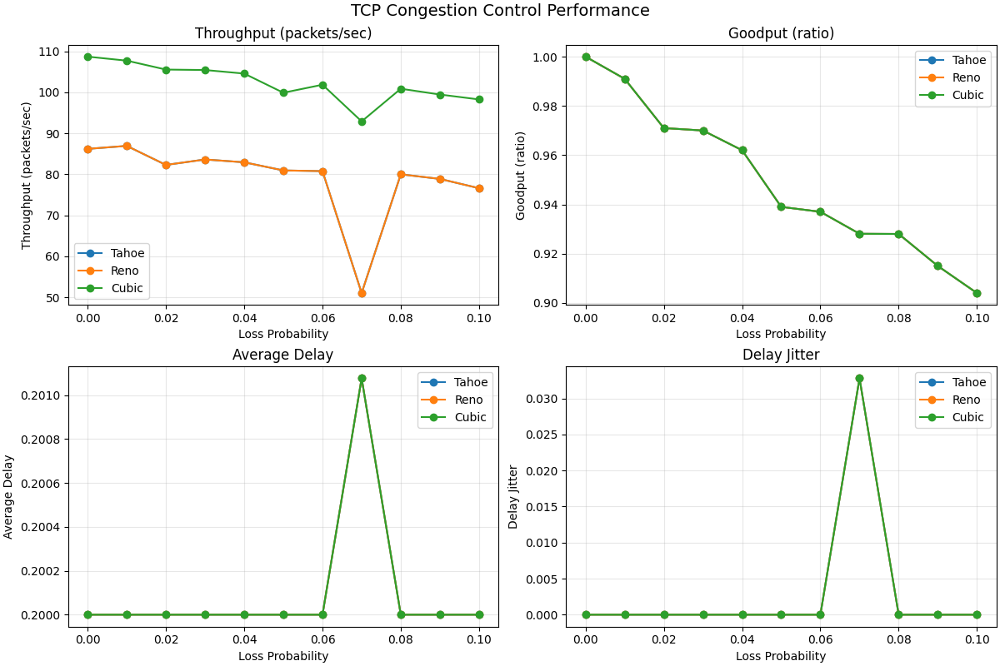
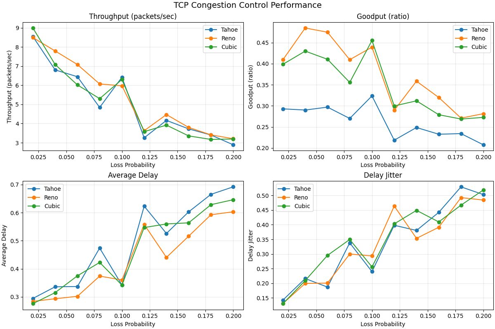
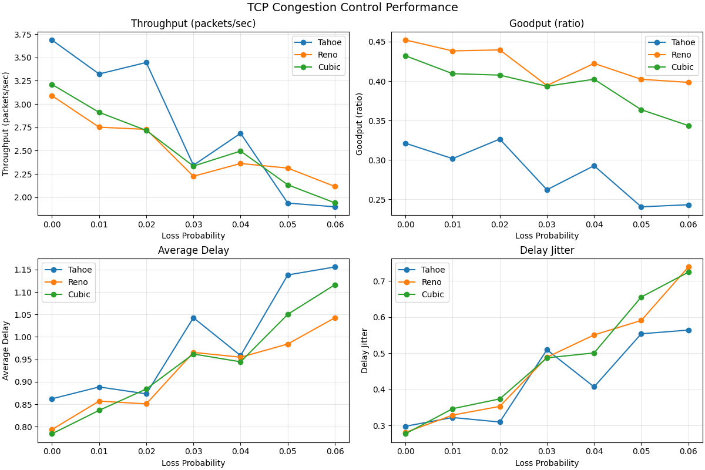

# PA-2 Report: TCP Tahoe vs Reno vs CUBIC in a Discrete Event Simulator

## 1. Objective

This project extends the PA2 TCP DES by adding TCP CUBIC and comparing it against Tahoe and Reno under different network conditions.

The assignment reference is RFC 9438, *CUBIC for Fast and Long-Distance Networks*.

## 2. RFC 9438 Digest (What Matters for Implementation)

CUBIC differs from Reno-style AIMD by using a time-based cubic growth function during congestion avoidance:

- It uses a concave then convex growth profile around the previous saturation point (`Wmax`).
- It preserves Reno-friendliness with `West` (Reno-equivalent estimate) when the cubic function would be too conservative.
- It uses multiplicative decrease with `beta_cubic = 0.7` (instead of Reno's 0.5 behavior).
- It is designed for better scalability and stability on higher-BDP paths.

Core ideas mapped into this PA2 implementation:

- CUBIC window target via the cubic function (`C = 0.4`, `beta = 0.7`).
- Reno-friendly fallback using `West` and `alpha_cubic = 3*(1-beta)/(1+beta)`.
- Multiplicative decrease on triple duplicate ACKs and timeout.
- Slow start behavior kept compatible with the project sender model.

## 3. Project Integration

### 3.1 Added files / changes

- Added `TCP_logic/cubic.py` (`TCPCubic` sender).
- Wired CUBIC into `TCP_logic/experiment.py` so all sweeps run Tahoe, Reno, and CUBIC.
- Generalized `TCP_logic/analysis.py` to summarize/plot an arbitrary algorithm set.
- Added tests in `tests/test_cubic.py` and an integration smoke test in `tests/test_integration.py`.
- Added long-distance runner `TCP_logic/run_integration_long_distance.py`.
- Updated automation in `run_all.sh` to run the long-distance scenario.

### 3.2 Validation

All tests pass after integration:

- `20 passed`

## 4. Simulation Setup

## 4.1 Shared DES assumptions

- Loss applies to data packets only.
- ACK path is reliable in the selected model.
- Per-packet timeout events may fire after ACK; stale timeouts are ignored.
- Jitter is population standard deviation.

### 4.2 Metrics

- **Throughput**: unique packets delivered per simulated second.
- **Goodput**: unique packets delivered / total packets sent (includes retransmissions in denominator).
- **Average Delay**: mean ACK delay from first send.
- **Jitter**: population stdev of packet delay.

## 5. Results Under Different Network Conditions

### 5.1 Condition A: Baseline sweep

- Loss sweep: `0.00` to `0.10` (step `0.01`)
- Receiver: simple cumulative ACK
- Default sender config

| Metric | Tahoe | Reno | CUBIC | Better |
|---|---:|---:|---:|---|
| Throughput | 79.1122 | 79.1122 | 102.2895 | CUBIC |
| Goodput | 0.9496 | 0.9496 | 0.9496 | Tie |
| Avg Delay | 0.2001 | 0.2001 | 0.2001 | Tie |
| Jitter | 0.0030 | 0.0030 | 0.0030 | Tie |

Figure:



### 5.2 Condition B: Harsher loss + gap-aware ACK behavior

- Loss sweep: `0.02` to `0.20` (step `0.02`)
- Receiver: gap-aware cumulative ACK
- `total_packets=400`, `timeout_interval=0.9`, `initial_cwnd=6.0`, `initial_ssthresh=24.0`

| Metric | Tahoe | Reno | CUBIC | Better |
|---|---:|---:|---:|---|
| Throughput | 5.0490 | 5.3912 | 5.0915 | Reno |
| Goodput | 0.2615 | 0.3737 | 0.3481 | Reno |
| Avg Delay | 0.4892 | 0.4324 | 0.4675 | Reno |
| Jitter | 0.3376 | 0.3309 | 0.3487 | Reno |

Figure:



### 5.3 Condition C: Long-distance (higher RTT) scenario

- Loss sweep: `0.00` to `0.06` (step `0.01`)
- Receiver: gap-aware cumulative ACK
- One-way propagation delay: `0.3s` (RTT about `0.6s`)
- `total_packets=600`, `timeout_interval=2.0`, `initial_cwnd=6.0`, `initial_ssthresh=24.0`

| Metric | Tahoe | Reno | CUBIC | Better |
|---|---:|---:|---:|---|
| Throughput | 2.7602 | 2.5122 | 2.5347 | Tahoe |
| Goodput | 0.2841 | 0.4210 | 0.3932 | Reno |
| Avg Delay | 0.9884 | 0.9213 | 0.9397 | Reno |
| Jitter | 0.4232 | 0.4757 | 0.4805 | Tahoe |

Figure:



## 6. Discussion

1. CUBIC increases sending aggressiveness in low-to-moderate loss baseline conditions, which improved throughput in this simulator.
2. In harsher and more loss-heavy conditions, Reno performed best overall by this implementation's measured metrics.
3. In the long-distance setting, no single algorithm dominated all metrics; Reno led in goodput/delay while Tahoe led in throughput/jitter.
4. This is realistic for a simplified DES: algorithm rankings depend strongly on loss model, ACK behavior, timeout settings, and flow composition.

## 7. Conclusion

The PA2 DES now supports all three congestion-control algorithms required for the group assignment comparison:

- Tahoe
- Reno
- CUBIC (RFC 9438-inspired)

The project demonstrates that CUBIC can deliver higher raw throughput in some environments, while Reno or Tahoe may remain more efficient in others depending on conditions and metric priorities.

## 8. Reproducibility

From project root:

```bash
./run_all.sh
```

Optional toggles:

- `RUN_ALT_SCENARIO=0` to skip alternate scenario
- `RUN_LONG_DISTANCE_SCENARIO=0` to skip long-distance scenario

Direct runners:

```bash
PYTHONPATH=. python -m TCP_logic.run_integration
PYTHONPATH=. python -m TCP_logic.run_integration_alt
PYTHONPATH=. python -m TCP_logic.run_integration_long_distance
```
